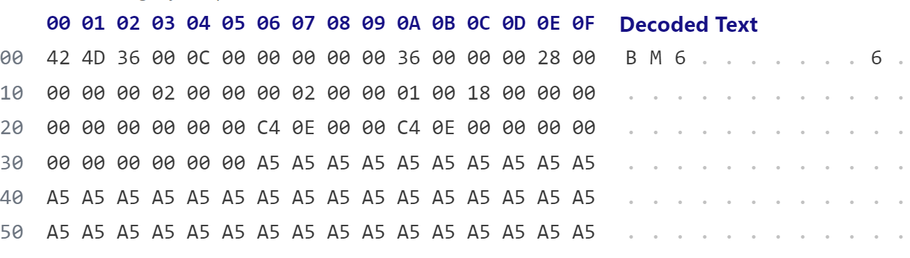

# dip作业心得
作为一个编程菜鸡，刚开始遇到dip的作业时，感到无从下手，这里列出一些我踩过的坑（有些相当愚蠢），大佬请一笑而过。

1. 第一次作业就让我们对bmp文件进行操作，但我们的C程课上对文件的读写这方面没着重讲，一些同学（比如我）一拿到手可能会不太清楚函数怎么使用。下面列出一般会用的fopen等函数

```c
    //打开文件并判断是否成功
    FILE *fp;//创建文件指针，在读写操作中要用到
    
    //fopen打开名称为"image.bmp"的文件，返回文件指针
    //"rb"的意思是read binary，读取二进制文件，还有很多参数可选，不多赘述
    fp = fopen("image.bmp", "rb"); 
    if (!fp) {//文件不存在则终止程序
        printf("BMP Image Not Found!\n");
        exit(0);
    }//成功打开可以输出提示信息
    printf("Successfully open the image\n");

```
```c
    //fread读取文件头和图像信息头
    fread(&bmfh, 14, 1, fp);
    fread(&bmih, 40, 1, fp);
    //读取位图数据（不推荐这么写）
    fread(&a, sizeof(PIXEL), pixel_num, fp);
    //fread函数读取文件数据，参数依次是
    //fread(数据块首地址（你要保存的地方）,元素大小, 元素个数,文件指针)
    //元素大小的单位是byte
    //这里的bmfh和bmih是bmp文件的位图文件头和位图信息头的结构体
    //结构体在后面给出，他们的大小分别是14和40个byte
```
这里为什么直接写bmfh的大小是14而不写    `sizeof(BITMAPFILEHEADER)` 呢？因为C语言的结构体大小会对齐最大子元素大小的整数倍，所以 `sizeof(BITMAPFILEHEADER)` 实际上为16（4个字节的整数倍）,在后续读取可能并发连锁性问题。
在读取文件后，别忘了close文件：
```
fclose(fp);
```
怎么往文件里写新的图像数据：
```c
    //打开一个bmp空白图像并写入数据，不存在则新建
    //"wb"意思是write binary
    fp = fopen("gray.bmp", "wb");
    // 与fread类似，fwrite(数据块首地址,元素大小, 元素个数,文件指针)
    fwrite(&bmfh, 14, 1, fp);//新的文件头
    fwrite(&bmih, 40, 1, fp);//新的信息头
    //写入位图数据
    fwrite(&new_pixel, 3, pixel_num, fp);
    fclose(fp);
```

2. 结构体的定义

   这部分在老师发的一本参考书（html格式，图像信息处理-c语言）上有，但他不会告诉你，我翻学长的报告才发现这些东西，在这里复制过去可以省很多事。这些参数可以看书/ppt找意思
```c
//这几个字长的变量定义可以直接#include<windows.h>
typedef unsigned char BYTE; // 1 byte
typedef unsigned short WORD; // 2 bytes
typedef unsigned int DWORD; // 4 bytes
typedef int LONG; // 4 bytes

//位图文件头
typedef struct tagBITMAPFILEHEADER {
WORD bfType;//指定文件类型，必须是0x424D，即字符串“BM”
DWORD bfSize;//指定文件大小，包括这14个字节。
WORD bfReserved1;
WORD bfReserved2;//为保留字，不用考虑
DWORD bfOffBits;
} BITMAPFILEHEADER;

//位图信息头
typedef struct tagBITMAPINFOHEADER{
DWORD biSize;
LONG biWidth;
LONG biHeight;
WORD biPlanes;
WORD biBitCount;
DWORD biCompression;
DWORD biSizeImage;
LONG biXPelsPerMeter;
LONG biYPelsPerMeter;
DWORD biClrUsed;
DWORD biClrImportant;
} BITMAPINFOHEADER;
```

3. 图像数据的读取、储存。

   我的一个简单的想法是保存在一维数组中，每个元素有rgb三个分量，然而这在后面的几何变换（需要将像素的坐标变换）会很麻烦，所以推荐这么写（二维数组）：
```c
    typedef struct tagPIXEL {
    BYTE red;
    BYTE green;
    BYTE blue;
    } PIXEL;

    PIXEL *a[bmih.biHeight];//bmih.biHeight：图像高度
    for (int i=0;i<bmih.biHeight;i++){
        a[i] = (PIXEL*)malloc(sizeof(PIXEL)*bmih.biWidth);
    }
    
    //一般来说，.bMP文件的数据从下到上，从左到右存放
    for(int i=bmih.biHeight-1;i>=0;i--){
        fread(a[i], sizeof(PIXEL), bmih.biWidth, fp);
    }//一行一行地读数据
```
这样一来 `a[i][j]`就是第i行第j列的元素了，记得要用malloc，直接申请数组的话非常容易爆（谁会这么干？就是我）。
别忘了bmp文件每一行字节数要是4的整数倍，这里的bmih.biWidth需要进行转换（可以自己思考下）。
当然这只是我自己的写法，有的同学还会创作一大堆聚合的结构体、调色盘等等。但这样定义对作业的基本内容来说还是够用的。

4. 得到个性化bmp源文件

   老师自己就会用本人在漫展上拍的手办照片作为图像处理的素材，如果不想用别人那拿来的Lena.bmp当原图，而是想换成自己老婆的照片（或者别的什么）的话，可以在Matlab上用下面的代码进行格式转换
```matlab
A=imread('wife.jpg');
imwrite(A,'wife.bmp','bmp');
```
如果有装Matlab，这可以说是最简便的方法了。（做计逻大程处理图像时用Matlab也挺好）

------
5. 小技巧

   可以用 Hex editor 查看 bmp 文件的文件头（以及位图数据），可以用来看看改的对不对。（大概长这样）
   
   
   
   这时候你如果进入调试页面，可能会发现奇怪的问题：

* bfType 指定文件类型，必须是0x4D42，即字符串“BM”，
* 调试界面也显示读到的 bfType 是0x4D42
* Hex editor却显示 bfType（即开头的两个字节）=0x424D，这是为什么呢？
   
这就是大端小端的问题：bmp文件是二进制，也就是相对的小端，你写的程序是大端，大端从小端中读数据，会从低字节开始读（一个byte一个byte地读，不是bit）0x424D就变成0x4D42了。

-----
6. 菜鸡未能掌握的：怎么改文件头和调色盘把图像变成灰度图或者重点色图，一改就出错

遇到问题欢迎找我讨论捏，图像处理还是挺有意思的（比心）
